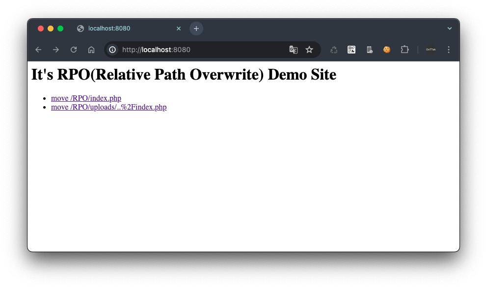
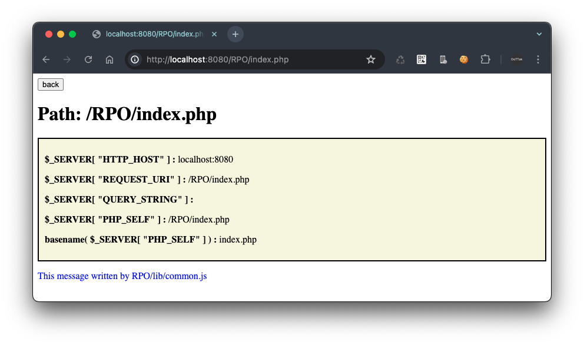
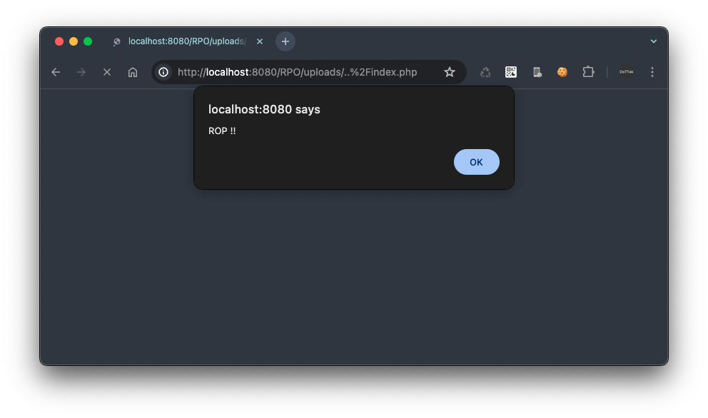
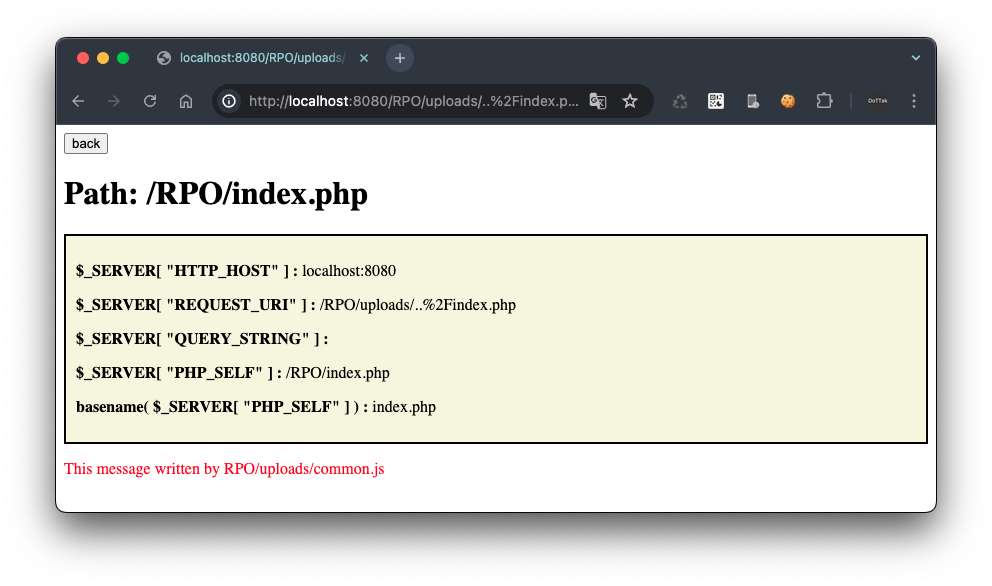

# Relative-Path-Overwrite

## Description
`PHP` + `Nginx` environment demo website to demonstrate the RPO (Relative-Path-Overwrite) vulnerability

## Build & Run
1. Docker Build
    ```
    docker build -t php-nginx .
    ```
2. Docker Run
    ```
    docker run -d -p 8080:8080 -v ./src:/var/www/html --name php-rpo php-nginx
    ```
3. Open [localhost:8080](localhost:8080)

## Screenshots



